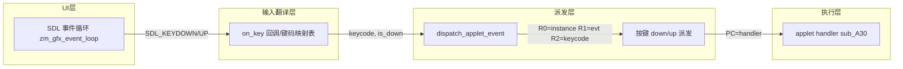

## 用户需求
为 ZMAEE 模拟器实现完整的键盘输入系统：将有窗口模式下 SDL 捕获的物理按键，按用户指定的映射关系转换为 ZMAEE 按键事件，派发到正在运行的 applet 的事件处理函数。同时需要"挖掘"（查证/确定）ZMAEE 的按键码（keycode）约定，确保每个映射的 keycode 数值正确。

## 按键映射需求（用户指定）
- 数字键使用键盘**左侧主键盘**数字（0-9），**非**右侧 NumPad
- W→上、S→下、A→左、D→右
- Q→左确认（SOFT_LEFT/CENTER 确认键）、E→右返回（SOFT_RIGHT/BACK 返回键）
- 0→0、1→1、...、9→9（主键盘数字逐一映射）
- C→挂机键、Z→拨号键、N→*键、M→#键

## 产品概述
在模拟器有窗口（SDL）交互模式下，把 PC 键盘按键翻译成 ZMAEE 设备按键码，并通过现有的 applet 事件派发通道（`dispatch_applet_event`）注入按键 down/up 事件，使游戏/应用能够用键盘操作（方向移动、确认、返回、数字输入、拨号、挂机、*、#）。

## 核心特性
- 在 SDL 事件循环中捕获主键盘按键（按下与抬起），排除 NumPad 数字键
- 建立"物理键 → ZMAEE keycode"集中映射表，覆盖上/下/左/右/确认/返回/0-9/拨号/挂机/*/#
- 按键按下派发"按键 down"事件，抬起派发"按键 up"事件（与 penDown/penUp 成对一致）
- 键码通过 event.h 的 `dispatch_applet_event` 派发，keycode 放在 R2（x 参数）位置
- 保留现有鼠标触摸、ESC 退出功能，不破坏无头模式


## 技术栈
- 复用现有技术栈：C + Unicorn(ARM) + SDL2
- 不改动 Unicorn 仿真、渲染、音频等子系统，仅扩展事件输入层

## 实现思路
### 1. 确定按键事件码与 keycode 约定
- **事件码**：采用 5~8 范围（`ZMAEE_EV_KEY_BASE=0x05`）。现有 event.c 注释确认 00000405 用事件码 6 携带 keycode（`a2==6 (keycode∈{0..9})`）。故按键按下用事件码 6（KEY_DOWN），按键抬起用事件码 5（KEY_UP）——两者都携带 keycode。
- **keycode 约定**：数字键 keycode 直接等于数字值 0..9（event.c 注释交叉验证）。其余功能键采用集中配置的枚举值，统一放在 `zm_key_code.h`，便于后续依据真实 applet 反汇编校正。方案采用 AEE 风格小整数值：
  - 数字 0-9 → keycode 0-9
  - * → 10， # → 11
  - 左软键/确认（Q）→ 12，右软键/返回（E）→ 13
  - 拨号（Z）→ 14，挂机（C）→ 15
  - 上（W）→ 16，下（S）→ 17，左（A）→ 18，右（D）→ 19

> 说明：`zm_key_code.h` 现有顺序枚举（KEYCODE_1=0, KEYCODE_2=1...）与"数字键 keycode=0..9"的已验证约定冲突，本次按数字即 keycode 的方案重排，并保留功能键枚举名，全部集中一处配置，便于后续按真实 applet 校正。

### 2. 扩展事件派发
- 在 `event.h/event.c` 新增按键派发函数：
  - `on_key_event(uint32_t keycode, uint32_t is_down)`：按下→`dispatch_applet_event(KEY_DOWN_EVT, keycode, 0)`；抬起→`dispatch_applet_event(KEY_UP_EVT, keycode, 0)`。
  - 沿用 `dispatch_applet_event` 现有机制，keycode 放入 x(R2) 参数，y(R3)=0。
- 复用 `zm_gfx_event_loop` 返回 `true` 让模拟器继续执行 handler 的既有协议。

### 3. 在 SDL 事件循环中接入按键捕获
- 在 `zm_gfx_event_loop` 的 `SDL_KEYDOWN`/`SDL_KEYUP` 分支中，新增一个 `on_key` 回调参数（仿照现有 `on_click` 回调签名），把 SDL 按键 sym 翻译为 keycode 后调用。
- 明确区分主键盘 `SDLK_0..SDLK_9` 与 NumPad `SDLK_KP_0..SDLK_KP_9`（后者不触发数字映射）。
- 保持 ESC 退出逻辑不变。
- 按键捕获仅在有窗口模式生效；无头模式（headless）无 SDL 窗口，自然不受影响。

### 4. 映射表集中配置
- 在 `zm_key_code.h` 提供 `zm_sdl_to_keycode(SDL_Keycode sym)` 的声明与实现（或放在 event.c），集中存放"SDL 物理键 → ZMAEE keycode"映射，含字母 W/S/A/D/Q/E/C/Z/N/M、数字 0-9、*、#。

## 实现细节与防回归
- 复用现有 `dispatch_applet_event` 与 `zm_gfx_event_loop` 协议，不新建调度层，避免架构膨胀。
- keycode 常量集中在 `zm_key_code.h`，逻辑集中在 event.c，UI 捕获在 zm_gfx.c，职责清晰。
- 数字键事件可考虑与现有 `g_auto_clicks`/无头模式互不干扰（有窗口才走键盘路径）。
- 不引入新依赖，不改动渲染/音频/内存布局。
- 保持向后兼容：现有鼠标点击、ESC 退出行为不变；其他 applet 未处理 5/6 事件时仍走默认分支（返回 1），无副作用。

## 架构设计


## 目录结构
```
src/
├── zmaee/inc/zm_key_code.h   # [MODIFY] 重新定义 keycode 常量（数字即 0-9）并提供映射表声明
├── event.h                   # [MODIFY] 声明 on_key_event 按键派发函数
├── event.c                   # [MODIFY] 实现 on_key_event 及 SDL按键→keycode 映射函数
├── zmaee/gfx/zm_gfx.h        # [MODIFY] zm_gfx_event_loop 增加 on_key 回调参数
└── zmaee/gfx/zm_gfx.c        # [MODIFY] SDL_KEYDOWN/UP 分支调用 on_key，接入按键捕获
```

## 关键代码结构（约定说明）
- 事件码约定：KEY_DOWN=0x06（携带 keycode），KEY_UP=0x05（携带 keycode）
- keycode 约定：数字 0-9=0-9；*=10；#=11；左确认(Q)=12；右返回(E)=13；拨号(Z)=14；挂机(C)=15；上(W)=16；下(S)=17；左(A)=18；右(D)=19
- 派发签名：`on_key_event(uint32_t keycode, uint32_t is_down)`，内部调用 `dispatch_applet_event(evt, keycode, 0)`
- 回调签名：`zm_gfx_event_loop(void (*on_click)(uint32_t,uint32_t), void (*on_key)(uint32_t keycode, uint32_t is_down), uint32_t timeout_ms)`

## 验证方式
- 编译（用户用 xmake 执行）：`xmake clean && xmake`
- 运行：`xmake run zm_emu -n 0 -o out/xxxxx xxxxx`（有窗口模式）
- 观察日志：按键按下/抬起时出现 `dispatch key event` 相关日志，applet 响应按键
- 回归：确认鼠标点击、ESC 退出、无头模式（`-H`）行为不变


本任务为逻辑层输入系统扩展，不涉及 UI 渲染变更，故不生成新的界面设计方案。

# Agent Extensions
- **code-explorer**: 用于在多个 applet 反汇编/源码中交叉验证按键事件码与 keycode 约定，确认 00000405 用事件码 6 携带 keycode 的数字键方案，以及验证现有 zm_key_code.h 枚举与真实约定的冲突点。
